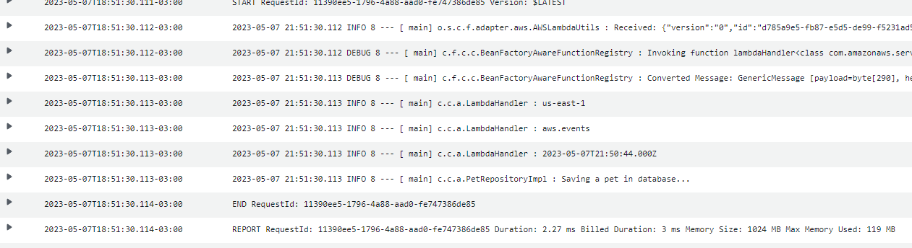

# AWS Lambda Scheduled Event Sample

* Spring Boot 2.7
* Spring Cloud v2021
* Spring Cloud Function Adapter AWS (from Spring Cloud v2021)

## Build

```sh
mvn -U clean install
```

## Build and Deploy

* Please, set up your AWS CLI with Account before deployment
* After, update **env.sh** file with your account id and AWS Region

```sh
./build-and-deploy.sh
```

## Event Processor

Examples

```java
@Component
public class LambdaHandler implements Consumer<ScheduledEvent> {
    private final PetRepository petRepository;

    public LambdaHandler(PetRepository petRepository) {
        this.petRepository = petRepository;
    }

    @Override
    public void accept(ScheduledEvent scheduledEvent) {
        log.info(scheduledEvent.getRegion());
        log.info(scheduledEvent.getSource());
        log.info(scheduledEvent.getTime().toString());

        petRepository.save(Pet.builder().build());
    }
}
```

Monitoring



## Tests

```java
@SpringBootTest
class LambdaHandlerTests {
    @MockBean
    PetRepository petRepository;

    @Autowired
    LambdaHandler lambdaHandler;

    @Test
    void shouldSaveAPetWhenFiring() {
        var scheduledEvent = new ScheduledEvent();

        scheduledEvent.setTime(DateTime.now());
        scheduledEvent.setRegion("us-east-1");
        scheduledEvent.setSource("aws.events");

        Mockito.doNothing().when(petRepository).save(Mockito.any());

        lambdaHandler.accept(scheduledEvent);

        Mockito.verify(petRepository, Mockito.times(1)).save(Mockito.any());
    }
}
```